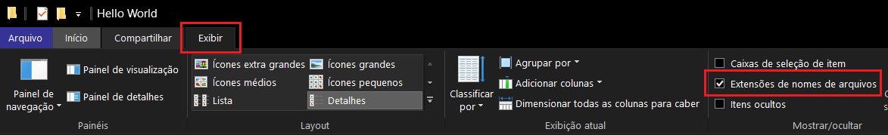

# Atividade-GCC132
 **Criar seu primeiro programa em c++ é bem símples, e pode ser feito em poucos passos:**

* Crie um novo arquivo com o nome "hello.cpp"
  * Caso esteja usando windows, pode ser necessário ativar a seguinte opção no Windows Explorer:
  
* Abra o arquivo com o editor de texto de sua preferência, e insira o seguinte código:
  ```
  #include <iostream>

  int main() {
      std::cout << "Hello World!";
      return 0;
  }
  ```
  * Para a próxima etapa será necessário um compilador, caso não tenha um instalado siga os passos disponíveis [nesse link](https://www.cs.odu.edu/~zeil/cs250PreTest/latest/Public/installingACompiler/#installing-a-c-compiler-on-microsoft-windows) para o seu sistema.
* Após salvar o arquivo, abra seu terminal na pasta onde o arquivo foi salvo e insira os seguintes comandos para compilar e executar o programa:
  ```
  g++ -o hello.out hello.cpp
  ./hello.out
  ```
